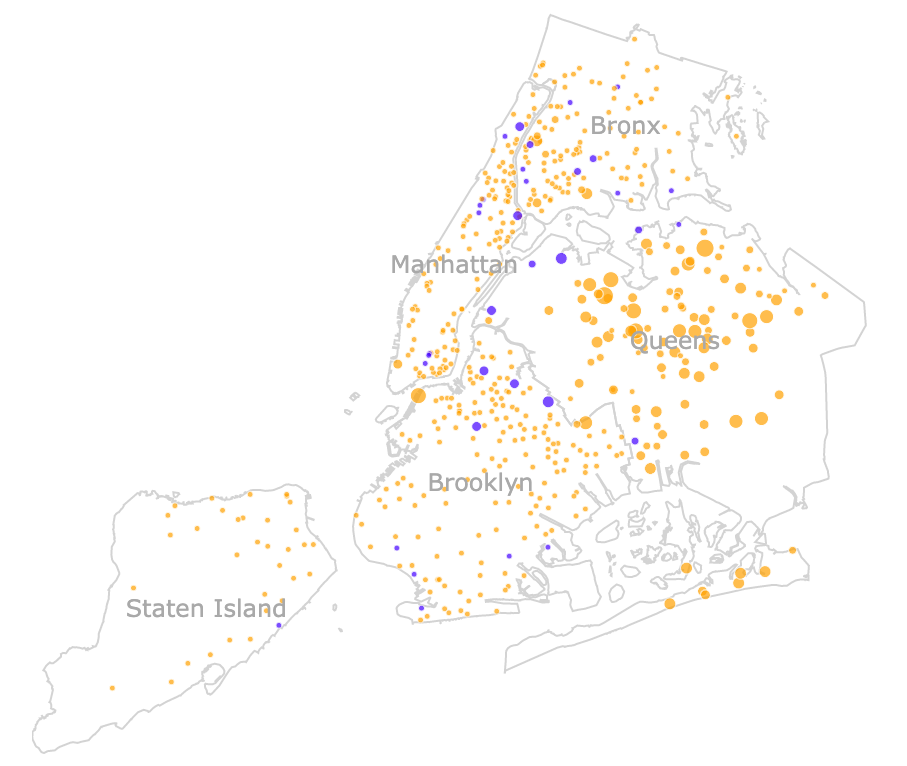

# nyc_bb
Visualization of New York City Public Basketball Courts

The notebook ([nyc_bb.ipynb](https://github.com/basketballrelativity/nyc_bb/blob/master/nyc_bb.ipynb)) explores the capabilities of the [plotly](https://plot.ly/) visualization package. NYC Open Data powers this exploration through the [borough boundaries](https://data.cityofnewyork.us/City-Government/Borough-Boundaries/tqmj-j8zm) and [directory of basketball courts](https://data.cityofnewyork.us/Recreation/Directory-of-Basketball-Courts/b937-zdky) datasets. Checkout a static image of the visualization below and the interactive version [here](https://basketballrelativity.github.io/personal/nyc_bb)!

